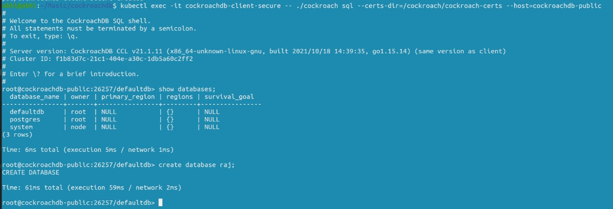

# raj-kubernetes-challenge

# Deploy cockroachDB cluster on Kubernetes

## _Deploy cockroachDB Cluster on DigitalOcean Kubernetes_


For the [DigitalOcean Kubernetes Challenge](https://www.digitalocean.com/community/pages/kubernetes-challenge), I wanted to deploy a SQL database to a managed Kubernetes cluster, and decided to go with [CockroachDB](https://www.cockroachlabs.com/docs/stable/install-cockroachdb-windows.html).
## Getting started
In this guide you will get to know how to deploy cockroachDB Cluster on DigitalOcean Kubernetes (DOKS)
Some prerequisites:
- Git installed on your system
- [kubectl](https://kubernetes.io/docs/tasks/tools/) commandline tool installed

The process to deploy on Kubernetes was simple. I just followed the instructions in [CockroachDB official documentation](https://www.cockroachlabs.com/docs/v21.2/deploy-cockroachdb-with-kubernetes.html), with just one change - In ["Step 1. Start Kubernetes"](https://www.cockroachlabs.com/docs/v21.2/deploy-cockroachdb-with-kubernetes.html#step-1-start-kubernetes), instead of using hosted GKE or EKS (as mentioned in the docs), I used DigitalOcean's [Managed Kubernetes](https://www.digitalocean.com/products/kubernetes/) service.

## Set up a cluster using the GUI.
**1.1** On dashboard of Digital ocean click on Kubernetes on left hand side menu

**1.2** Now in kubernetes, click the Create kubernetes cluster button.

**1.3** Select create  cluster


**1.4** Customize your cluster , I left everything as default


**1.5** click ***Create Cluster*** at the bottom of the page.


**1.6** You should be taken to your cluster's page. Provisioning should be done in a few minutes.


**After the successful creation Now we will setup CockroachDB in our cluster**.

## Connecting to Kubernetes Cluster.
**2.1** After the successful creation of the cluster, you will be greeted with a panel like this, Download the config file from the dashbord:


**2.2** Export the path of the config file to the **KUBECONFIG** environment variable:
```sh
export KUBECONFIG=kube_config_cluster.yml
```
## Deploy CockroachDB in Kubernetes Cluster.
Apply the [custom resource definition (CRD)](https://kubernetes.io/docs/concepts/extend-kubernetes/api-extension/custom-resources/#customresourcedefinitions) for the Operator:


```sh
kubectl apply -f https://raw.githubusercontent.com/cockroachdb/cockroach-operator/v2.4.0/install/crds.yaml
```

you will see somthing like this
```sh
customresourcedefinition.apiextensions.k8s.io/crdbclusters.crdb.cockroachlabs.com created
```

To use default namespace settings for operator apply operator.yaml file.

```sh
kubectl apply -f https://raw.githubusercontent.com/cockroachdb/cockroach-operator/v2.4.0/install/operator.yaml
```

Set your current namespace to use `cockroach-operator-system`. 
```sh
kubectl config set-context --current --namespace=cockroach-operator-system
```

Validate that the Operator is running using `kubectl get pods` and verify the status is set to Running

## Intializing Cluster.
Download example.yaml, a custom resource that tells the Operator how to configure the Kubernetes cluster.

```sh
curl -O https://raw.githubusercontent.com/cockroachdb/cockroach-operator/v2.4.0/examples/example.yaml
```

Apply `example.yaml`:
kubectl apply -f example.yaml


check that the pods were created using `kubectl get pods --watch` and make sure that status of pods is Running.

## Use the built-in SQL client
To use the CockroachDB SQL client, first launch a secure pod running the `cockroach` binary.

```sh
kubectl create -f https://raw.githubusercontent.com/cockroachdb/cockroach-operator/master/examples/client-secure-operator.yaml
```

Get a shell into the pod and start the CockroachDB

```sh
kubectl exec -it cockroachdb-client-secure \
-- ./cockroach sql \
--certs-dir=/cockroach/cockroach-certs \
--host=cockroachdb-public
```



